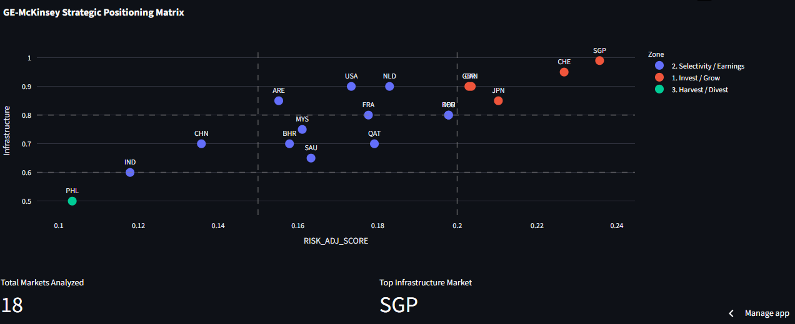

# Global Market Entry Simulation Engine



I built this tool to automate how I evaluate new global markets. Most market entry decisions rely on gut feel or outdated reports, so I created a pipeline that pulls live economic data from the World Bank and runs it through a weighted scoring model based on the GE-McKinsey Nine-Box Matrix.

[View Live Dashboard](https://market-entry-simulator.streamlit.app/)|[Download Market Entry Simulation Case Study (PDF)](case-study.pdf)

---

## How it works
Each market is assigned a `RISK_ADJ_SCORE` based on these four factors:
- **GDP Velocity (40%):** It had 15-year growth trajectory.
- **Inflation Penalty (10%):** CPI volatility.
- **Labor Capacity (30%):** Workforce participation metrics.
- **Infrastructure (20%):** Ease of Doing Business score.

  I added a small Gaussian noise term (σ = 0.005) to the growth inputs. Real economies aren't perfectly predictable, and I didn't want the model's output to have falsely deterministic results.
 
---

## Architecture

- **ETL pipeline:** A Python script runs weekly via GitHub Actions to query the World Bank API, process the metrics, and update `market_engine_cache.csv`.
- **Dashboard:** I built the front end in Streamlit and Plotly. It reads directly from the cache to keep load times snappy and avoid dependency on live API calls.
- **Outputs:** The dashboard categorizes markets into "Target," "Watch," or "Avoid." I chose this over simple rankings because clear categories are easier to act on than a long, ambiguous list.
---

## Project Structure

```
├── .github/workflows/      # CI/CD pipeline for automated data updates
├── app.py                  # Streamlit dashboard
├── main.py                 # ETL engine and scoring logic
├── market_engine_cache.csv # Processed market data (auto-updated)
└── requirements.txt        # Dependencies
```

---

## Run It Locally

```bash
git clone [your-repo-url]
pip install -r requirements.txt
python main.py        # updates the cache
streamlit run app.py  # launch the dashboard
```

---
